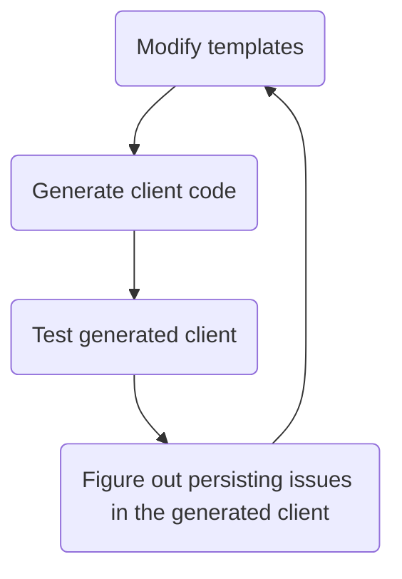

# Workflow

The following is the general workflow and guidelines for developing the Python client for osparcs public API. For brevity `clients/python` will be denoted by PYDIR

- From PYDIR run `make install-dev` to setup the development environment.
- The Python client is generated by [openapi-generator](https://github.com/ITISFoundation/openapi-generator). This is done via a docker image is used to generate the cliens is specified in `/scripts/common.Makefile`. To generate the client, run `make python-client` from PYDIR. This generates `clients/python/auto_generated_client` which contains all generated code.
- Changes to the client should not be performed within the generated python code, but in the templates in [openapi-generator](https://github.com/ITISFoundation/openapi-generator) so the client can be regenerated whenever new routes are added to the osparc public api server.
- This repo tracks the generated documentation in order for users to be able to access these via github pages. Moving the parts of the generated files into this repo which need to be tracked is done by running `make postprocess-generated-files` from PYDIR.

*Please do not manually `git commit` auto generated code into this repository, except for the documentation described above*

# Testing
Tests are located in `PYDIR/test` and can be run by executing the following commands from PYDIR:
```bash
make install-test
make test-dev
```
after the client has been generated (see the [workflow section](#workflow)). These tests should test the user-facing API.

# Tips
When modifying templates on the [openapi-generator](https://github.com/ITISFoundation/openapi-generator) repository the pace at which you can progress is determined by the speed at which you can loop through the following diagram



Hence, it is important to be able quickly modify the [templates](https://github.com/ITISFoundation/openapi-generator/tree/master/modules/openapi-generator/src/main/resources) and regenerate the client. To do this without rebuilding the docker image containing the openapi-generator, run `make python-client-from-templates path/to/template/dir` from `clients/python`.
