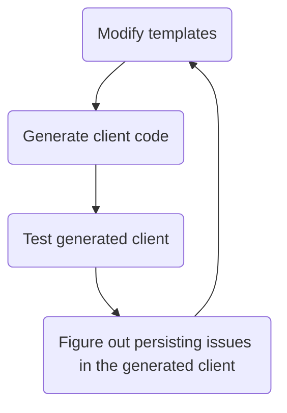

# Workflows

The following are the general workflow for working with the Python client for Osparc's public API. For brevity `clients/python` will be denoted by PYDIR

Run `make install-dev` from PYDIR to setup the development environment.

### The client code
- The Python client is generated by [openapi-generator](https://github.com/ITISFoundation/openapi-generator). This is done via a docker image is used to generate the cliens is specified in `/scripts/common.Makefile`. To generate the client, run `make python-client` from PYDIR. This generates `clients/python/artifacts/client` which contains all generated code.
- You can generate a wheel or a tar ball from this code by then runnign `make dist` from PYDIR. The artifacts will be places in `clients/python/artifacts/dist`

### The documentation
To generate the documentation, run `make docs` from PYDIR. This generates the client in `clients/python/artifacts/client` and postprocesses the documentation placed there.

## Guidelines
Changes to the client should not be performed within the generated python code, but in the templates in [openapi-generator](https://github.com/ITISFoundation/openapi-generator) so the client can be regenerated whenever new routes are added to the osparc public api server.

*Please do not manually `git commit` auto generated code into this repository*

# Testing
Tests are located in `PYDIR/test` and can be run by executing the following commands from PYDIR:
```bash
make install-test
make test-dev
```
after the client has been generated (see the [workflow section](#workflow)). These tests should test the user-facing API.

# Tips
When modifying templates on the [openapi-generator](https://github.com/ITISFoundation/openapi-generator) repository the pace at which you can progress is determined by the speed at which you can loop through the following diagram



Hence, it is important to be able quickly modify the [templates](https://github.com/ITISFoundation/openapi-generator/tree/master/modules/openapi-generator/src/main/resources) and regenerate the client. To do this without rebuilding the docker image containing the openapi-generator, run `make python-client-from-templates path/to/template/dir` from `clients/python`.

## Upcoming Deprecations

`osparc.models` and `osparc.api` modules have been (now) deprecated and will be retired/removed in the next version, please used `osparc` to import all the functions instead
