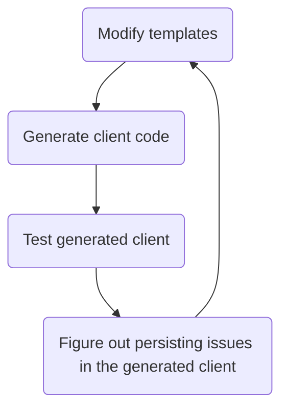

# Workflows

The following are the general workflow for working with the Python client for Osparc's public API. For brevity `clients/python` will be denoted by PYDIR

Run `make install-dev` from PYDIR to setup the development environment.

### The client code
- The Python client is generated by [openapi-generator](https://github.com/ITISFoundation/openapi-generator). This is done via a docker image is used to generate the cliens is specified in `/scripts/common.Makefile`. To generate the client, run `make python-client` from PYDIR. This generates `clients/python/artifacts/client` which contains all generated code.
- You can generate a wheel or a tar ball from this code by then runnign `make dist` from PYDIR. The artifacts will be places in `clients/python/artifacts/dist`

### The documentation
To generate the documentation, run `make docs` from PYDIR. This generates the client in `clients/python/artifacts/client` and postprocesses the documentation placed there.

## Guidelines
Changes to the client should not be performed within the generated python code, but in the templates in [openapi-generator](https://github.com/ITISFoundation/openapi-generator) so the client can be regenerated whenever new routes are added to the osparc public api server.

*Please do not manually `git commit` auto generated code into this repository*

# Testing
Tests are located in `PYDIR/test_osparc` and `PYDIR/test_osparc_client`. They can be run by executing the following commands from PYDIR:
```bash
make install-test
make tests
```
after the client has been generated (see the [workflow section](#workflow)). These tests should test the user-facing API. Jupyter notebooks in the PYDIR/docs folder are automatically run as part of the tests via `test_notebooks.py`. Hence, when writing a tutorial jupyter script, also think of it as a test. For this reason, any import of `osparc` in the notebook should be "guarded" by a `if importlib.util.find_spec('osparc') is None:` statement (see the [BasicTutorial](./docs/BasicTutorial.ipynb))

# Tips
When modifying templates on the [openapi-generator](https://github.com/ITISFoundation/openapi-generator) repository the pace at which you can progress is determined by the speed at which you can loop through the following diagram


```mermaid
  graph TD;
      A(Modify templates)-->B(Generate client code);
      B-->C(Test generated client);
      C-->D(Figure out persisting issues in the generated client);
      D-->A;
```

Hence, it is important to be able quickly modify the [templates](https://github.com/ITISFoundation/openapi-generator/tree/master/modules/openapi-generator/src/main/resources) and regenerate the client. To do this without rebuilding the docker image containing the openapi-generator, run `make python-client-from-templates path/to/template/dir` from `clients/python`.

## Upcoming Deprecations

`osparc.models` and `osparc.api` modules have been (now) deprecated and will be retired/removed in the next version, please used `osparc` to import all the functions instead


## Client e2e testing
The client e2e tests log all trace data when running. It can be useful to debug these using the copilot to anylize issues. This can be done by using the Grafana MCP server. Note you will need to create the mpc.json file for this and give the copilot access to Grafana. In a separate process you will need to run

```console
docker run --rm -p 8000:8000 -e GRAFANA_URL=<grafana url, e.g. https://monitoring.osparc-master.speag.com/grafana/> -e GRAFANA_SERVICE_ACCOUNT_TOKEN=<token> grafana/mcp-grafana
```

Now give the copilot access to the tests in this repository, as well as the logs of the failing tests and using the associated copilot skill (giving copilot some basic instructions on how to get started).
